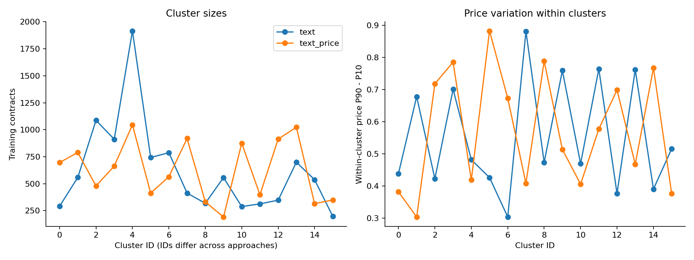
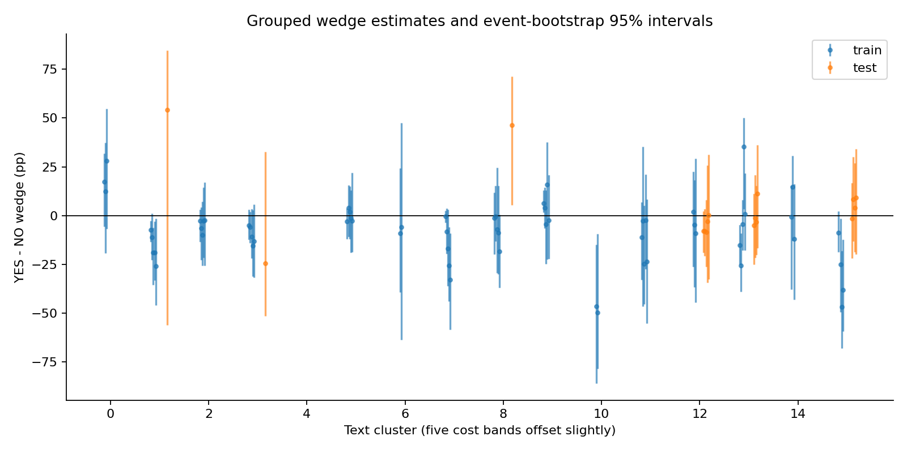
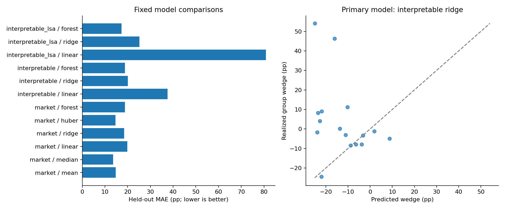
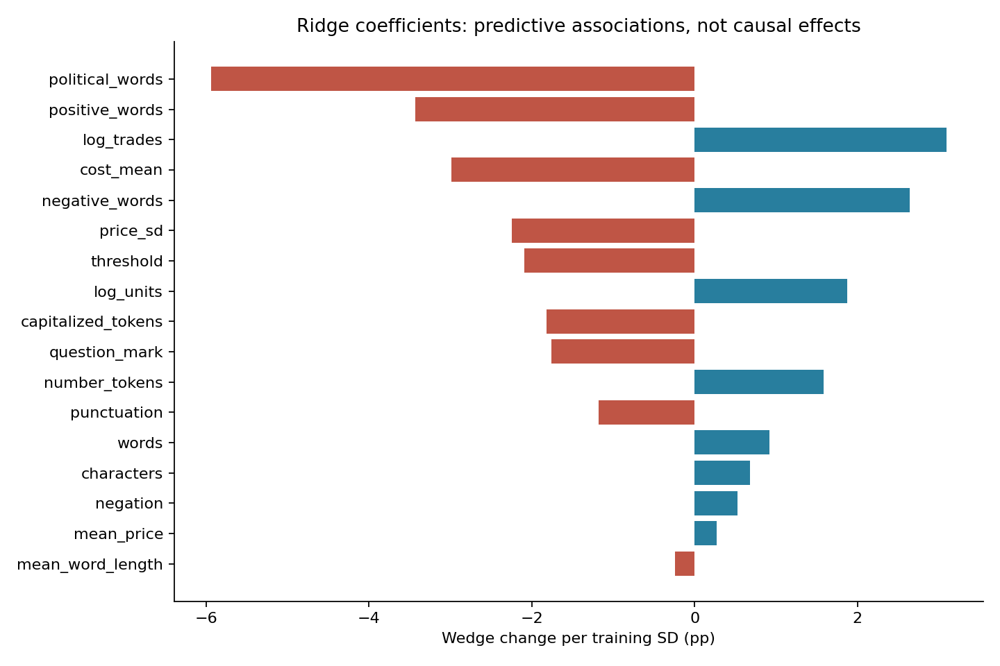
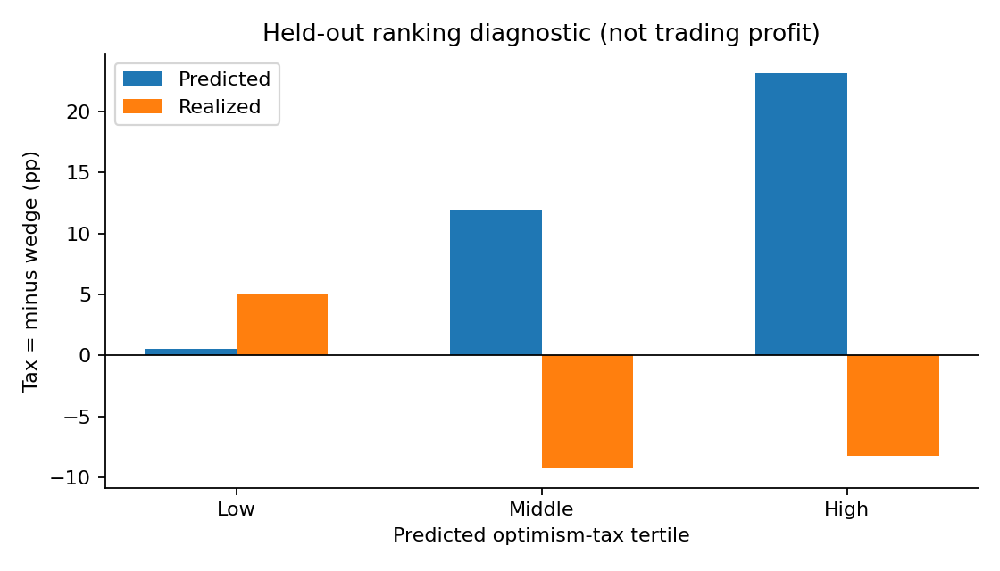

# MVP findings: predicting the optimism-tax wedge

At least one exploratory specification improves held-out MAE; this is not confirmatory evidence after multiple comparisons. The delivered analysis establishes a working estimator and evaluation pipeline, but does **not establish reliable future-market prediction or an exploitable liquidity-provider signal**.

The primary specification is text-based clustering plus interpretable ridge regression, predesignated in the pipeline; the development holdout is exploratory. Its held-out MAE is **20.11 probability percentage points**, versus **14.72** for the naive mean; RMSE is **29.85** and R² is **-1.42**. MAE improvement over the baseline is -5.39 pp, with a conditional cluster-block 95% interval [-10.83, 0.65]. These intervals are particularly fragile with only 6 held-out semantic clusters.

## Data and label coverage

The raw Kalshi extract has 7,682,445 market records and 72,134,741 executions. After finalization/binary-outcome, combination exclusion, metadata and 24-hour landmark screening, 356,171 market records are eligible for sampling. A deterministic sample of 60,000 yields **11,189 contracts** with at least 5 observation-window executions. The valid sampled window has 642,020 executions before the minimum-trade contract filter. See [attrition](attrition.json) for sequential counts.

The whole-series holdout contains 9,963 training contracts from 640 series and 1,226 test contracts from 188 series. Hash splitting series does not guarantee balanced contract counts. In the primary grouping there are **62 eligible train labels and 16 eligible test labels**, each constructed from multiple resolved contracts at matched costs. Minimums are 20 contracts and 10 events in each direction, plus exact-price support, execution counts and training-coherence screening. Failed rows remain marked in the [wedge dataset](wedges_text.csv).

The equal-row mean wedge changes from -8.26 pp in train to 4.42 pp in test. Test estimates span -24.42 to 54.10 pp; their sample SD is 19.82 pp and median event-bootstrap SE is 11.99 pp. These are descriptive variation measures that mix signal, sampling noise and population composition; they do not estimate between-group latent variance. A sign reversal across different populations is not evidence of a temporal regime shift.

## Clustering and price sensitivity

| approach | silhouette | price_bin_nmi | price_removal_adjusted_rand |
| --- | --- | --- | --- |
| text | 0.31 | 0.07 | 0.64 |
| text_price | 0.31 | 0.08 | 0.64 |

Low price-decile mutual information and retained within-cluster price variation suggest these maps are not simply price bins. The adjusted Rand agreement quantifies sensitivity to removing the bounded price block; it is not proof of economic coherence. Nearest-centroid titles and series composition are exported in [cluster profiles](cluster_profiles.csv). The text representation is title plus observed YES subtitle, represented by training-fitted TF-IDF/LSA. It is **not a pretrained sentence embedding**. A minimum training mean text cosine of 0.65 rejects diffuse clusters. Even compact clusters may join unrelated threshold events; see the [manual review](../CLUSTER_REVIEW.md).

## Model comparison

All errors are in probability percentage points; lower is better. The following uses primary text clusters and interpretable features (baseline shown once):

| block | model | mae_pp | rmse_pp | r2 |
| --- | --- | --- | --- | --- |
| market | mean | 14.72 | 23.00 | -0.44 |
| interpretable | linear | 37.59 | 49.22 | -5.58 |
| interpretable | ridge | 20.11 | 29.85 | -1.42 |
| interpretable | forest | 18.81 | 27.48 | -1.05 |

The [full comparison](model_comparison.csv) adds market-only and supplementary LSA blocks for both clustering approaches. There is no hyperparameter search or selection of a reported winner on test outcomes. Similarity and coherence safeguards were revised during exploratory development; a fresh holdout is required for confirmation. The two clustering approaches generate different groups/support and label counts: their raw errors are not a paired comparison on the same target rows. Compare each model with its own baseline. Ordinary least squares with many LSA predictors can extrapolate far outside the physically possible wedge range; predictions are intentionally not clipped after examining the holdout. This exposes its unsuitability at the current sample size.

## Secondary iteration: robust, conservative estimates

The first pass suggests that a few noisy group labels can pull squared-error fits away from typical outcomes. We added a training-median constant and a market-only Huber regression with strong fixed regularization (alpha 10). Both use training labels only; the same development holdout is reused, so any gain is exploratory.

| approach | model | mae_pp | mae_improvement_pp |
| --- | --- | --- | --- |
| text | mean | 14.72 | 0.00 |
| text | median | 13.57 | 1.15 |
| text | huber | 14.58 | 0.14 |
| text_price | mean | 16.62 | 0.00 |
| text_price | median | 15.52 | 1.10 |
| text_price | huber | 17.27 | -0.65 |

The median is a useful **default estimate of the typical eligible group wedge** when a point estimate is needed. It does not distinguish opportunities across groups. Huber retains some market-feature variation, but its small gain over the mean on text clusters is insufficient to validate ranking. The practical route is to use the robust estimate for screening and uncertainty-aware data collection, then test a conditional signal on a fresh chronological holdout before making any trading decision.

## Feature associations

The five largest absolute standardized coefficients of the primary ridge fit are:

| feature | coefficient_pp |
| --- | --- |
| political_words | -5.94 |
| positive_words | -3.43 |
| log_trades | 3.09 |
| cost_mean | -2.99 |
| negative_words | 2.64 |

A coefficient is the fitted wedge change per training-group SD, conditional on other inputs. A negative coefficient corresponds to a larger YES disadvantage. Features are aggregated at group level; these coefficients are neither contract-level effects nor causal estimates. Given weak held-out performance, they are exploratory training associations, not established generalizable predictors. Lexicon counts do not constitute validated sentiment or emotion measures.

## Preliminary signal ranking

Define optimism tax as **minus the wedge**, so a higher predicted tax is a predicted YES disadvantage. Rank test rows by the predesignated ridge predictions:

| quantile | rows | clusters | predicted_tax_pp | realized_tax_pp |
| --- | --- | --- | --- | --- |
| 1 | 5 | 2 | 0.54 | 5.02 |
| 2 | 5 | 3 | 11.94 | -9.25 |
| 3 | 6 | 3 | 23.16 | -8.25 |

Realized high-minus-low tax is **-13.27 pp**, with a cluster-block interval **[-59.78, 20.30] pp**; 179 of 200 resamples contain both extreme groups. The high group differs from the overall held-out realized tax by -3.83 pp. Empty extreme groups in some resamples and few clusters make the interval fragile. The signal is not validated merely by large predicted magnitudes.

These are pooled direction asymmetries, not maker profits. There are no historical executable spreads, fees, depth, queue/fill probabilities or inventory constraints in this MVP. No economic-exploitability claim is justified.

## Limits and recommended next steps

1. **Historical provenance:** versioned titles, scheduled closes and outcome-publication times are missing. Trade inputs stop at open+24h, but snapshot wording is assumed unchanged. This is a retrospective unseen-series evaluation, not a verified chronological forecast. All training labels may not have been known at an actual test landmark.
2. **Population and dependence:** resolved, non-combination, longer-lived, early-active contracts are a selected population. Series grouping prevents direct event reuse but does not capture every cross-product economic link. Aggregate group labels and shared price bands leave few effective independent observations.
3. **Comparability and uncertainty:** lexical similarity can group economically different events. Large label SEs, support differences and execution-weight concentration limit interpretation. Refine the event graph and manual coherence checks; test fixed exact-price support and contract-balanced weighting before increasing model complexity.
4. **Missing feature blocks:** authoritative categories, historical order books, validated NLP and pretrained embeddings remain unavailable/deferred. The [availability assessment](../DATA_AVAILABILITY.md) identifies the additional inputs; do not reinterpret literal proxies as those missing fields.
5. **Next experiment:** acquire historical provenance, reserve a fresh future period, and run rolling event-purged predictions with already-settled training labels. Check sensitivity to window, support, clustering and uncertainty unit. Add execution-aware trading tests only after the predictive signal survives that design. Causal framing effects require a separate wording experiment.

Reproduce with `python -m mvp.pipeline` from the repository root; see [methodology and run instructions](../README.md), [source code](../pipeline.py) and [run manifest](run_manifest.json). All figures and tables above are generated from real repository data; synthetic data are confined to correctness tests.
